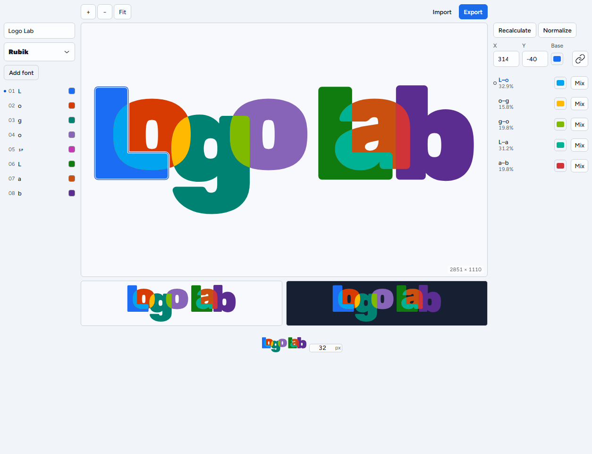

# LogoLab

[Try LogoLab](https://ericchansen.github.io/logolab)

A client-only workbench for positioning real font outlines and coloring exact pair and N-way
glyph intersections.



## Development

Requires Node.js 22, npm 10, and Microsoft Edge for E2E tests.

```powershell
npm install
npm run dev
npm run lint
npm run typecheck
npm test
npm run build
npm run test:e2e
```

## Architecture

`opentype.js` extracts native curves. `polygon-clipping` discovers mutually exclusive overlap
sets from 0.5-unit flattened contours. `src/domain/svg.ts` renders original curves for the
editor, proofs, SVG, and PNG source.

Every non-anchor glyph in an overlap is clipped in the anchor glyph local coordinates:

```text
translate(member.x - anchor.x, member.y - anchor.y)
```

Fresh IDs avoid Edge clip cache reuse. Export recalculates stale overlap data before writing.
Designs autosave per font and text in localStorage; local fonts use IndexedDB.

## Font licenses

The bundled static or deterministically instantiated font files remain under SIL Open Font
License 1.1.

| Family | Bundled style | License |
| --- | --- | --- |
| Archivo | Black 900 | `third_party/fonts/archivo/OFL.txt` |
| Bricolage Grotesque | ExtraBold 800 | `third_party/fonts/bricolagegrotesque/OFL.txt` |
| Figtree | Black 900 | `third_party/fonts/Figtree/OFL.txt` |
| Fraunces | 144pt Black 900 | `third_party/fonts/fraunces/OFL.txt` |
| Manrope | ExtraBold 800 | `third_party/fonts/manrope/OFL.txt` |
| Plus Jakarta Sans | ExtraBold 800 | `third_party/fonts/plusjakartasans/OFL.txt` |
| Rubik | Black 900 | `third_party/fonts/Rubik/OFL.txt` |
| Sora | ExtraBold 800 | `third_party/fonts/Sora/OFL.txt` |
| Space Grotesk | Bold 700 | `third_party/fonts/spacegrotesk/OFL.txt` |
| Syne | ExtraBold 800 | `third_party/fonts/syne/OFL.txt` |
| Unbounded | Black 900 | `third_party/fonts/unbounded/OFL.txt` |
| Work Sans | Black 900 | `third_party/fonts/worksans/OFL.txt` |

Application source is MIT licensed.
